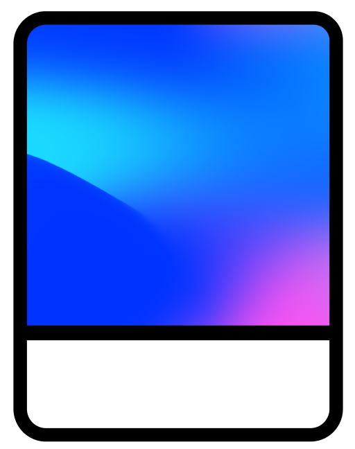

<p align="center">
  <a href="https://equal-ui.github.io/Equal/">
    
  </a>

<p align="center">


<a href="https://twitter.com/EqualVue">
    
</a>
</p>
</p>

<h1 align="center">
  Equal UI
</h2>

<div align="center">
Equal UI is a Vue 3 hackable components library with 30+ components on top of Tailwindcss
<br>
  <a href="https://equal-ui.github.io/Equal/"><strong>Explore Equal UI docs</strong></a>
</div>

# Features

- Enterpise class UI based on Equal design system
- Built-in dark theme
- Full components customization
- Theme building feature with Tailwindcss
- Lightweight: 18KB brotli
- Includes 30+ components
- Based on TypeScript

# Links

<b> Twitter: </b> [@Yan](https://twitter.com/k0mmsussertod)

# Install

You need [Vue.js](https://v3.vuejs.org/) version 3.1+

```bash
# npm
npm install equal-vue
```

```bash
# yarn
yarn add equal-vue
```

# Usage

## All components

```js
import { createApp } from 'vue'
import Equal from 'equal-vue'
import Config from 'equal-vue/dist/full' // or light / dark theme

createApp.use(Equal, Config)
```

## Or individual components

```js
import { createApp } from 'vue'
import { Button, Switch } from 'equal-vue'
import Config from 'equal-vue/dist/full' // or light / dark theme

createApp.use(Button, Config).use(Switch, Config)
```

# License

[MIT](https://raw.githubusercontent.com/quatrochan/Equal/master/LICENSE)
